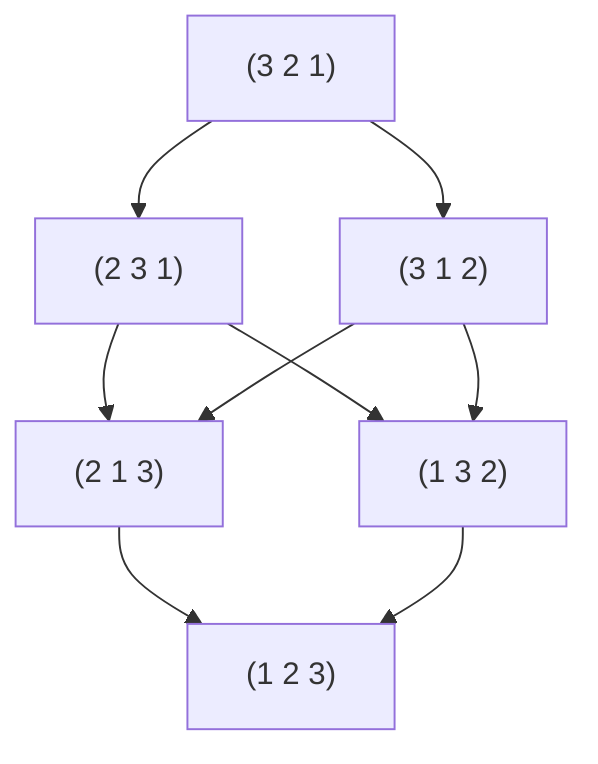
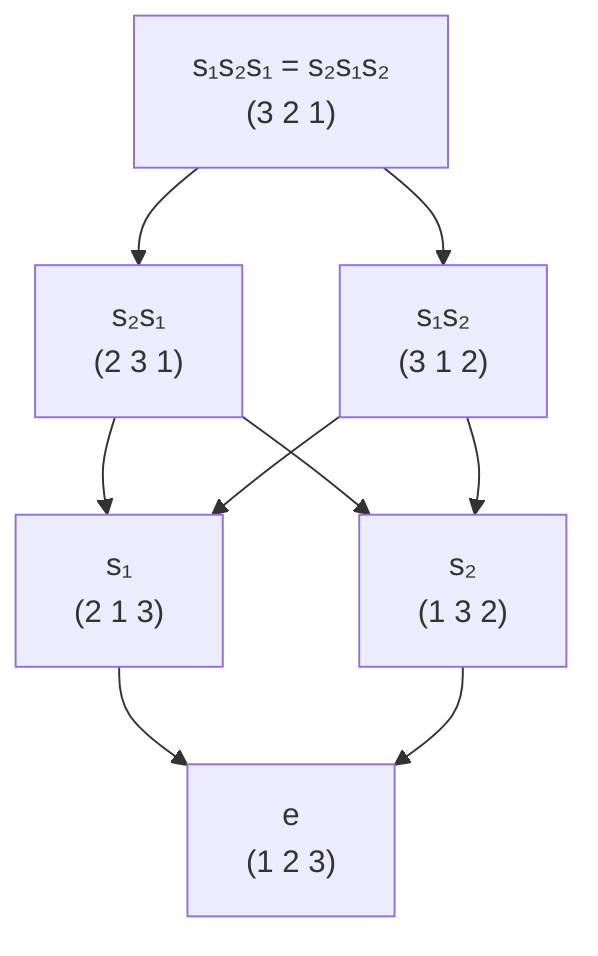
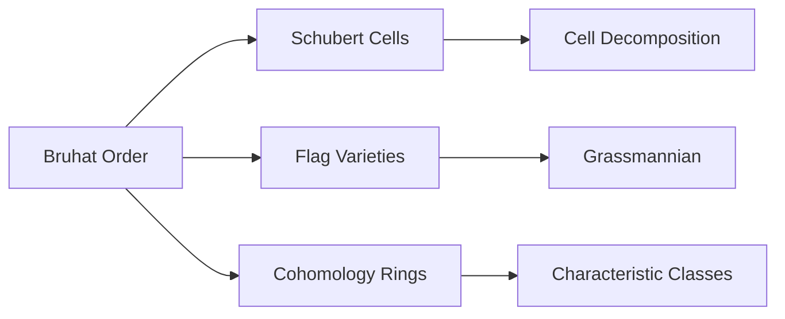
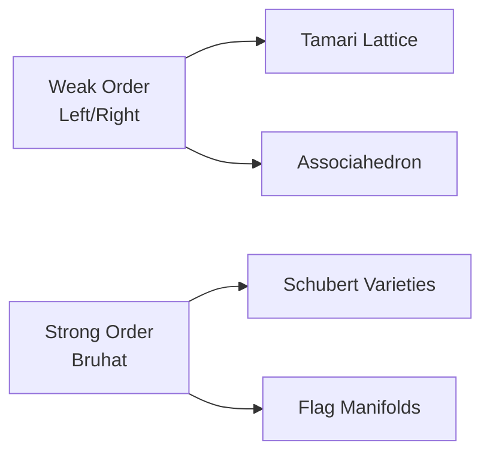

# Bruhat Order - Thứ tự Bruhat

## 1. Giới thiệu và Động lực

**Bruhat order** là một cách sắp thứ tự các phần tử trong nhóm hoán vị $S_n$ (hoặc tổng quát hơn, trong nhóm Weyl), dựa trên mức độ "phức tạp" của chúng. Thứ tự này có vai trò quan trọng trong hình học đại số, lý thuyết biểu diễn và tổ hợp.

### Trực giác ban đầu
Hãy tưởng tượng ta có một dãy số bị trộn lẫn (một hoán vị) và muốn sắp xếp về thứ tự tự nhiên bằng các phép hoán đổi cặp. Số bước ít nhất cần thiết chính là độ đo "mức độ phức tạp" của hoán vị đó.

---

## 2. Ví dụ minh họa với $S_3$

### 2.1. Các hoán vị trong $S_3$
Nhóm hoán vị $S_3$ gồm 6 phần tử:
- $e = (1\ 2\ 3)$ - hoán vị đơn vị
- $(1\ 3\ 2)$ - hoán đổi 2 và 3  
- $(2\ 1\ 3)$ - hoán đổi 1 và 2
- $(2\ 3\ 1)$ - chu trình 3 phần tử
- $(3\ 1\ 2)$ - chu trình 3 phần tử
- $(3\ 2\ 1)$ - hoán vị đảo ngược hoàn toàn

### 2.2. Biểu đồ Bruhat order trên $S_3$

**Giải thích:**
- **Tầng 0**: $(1\ 2\ 3)$ - hoán vị đơn vị (độ dài 0)
- **Tầng 1**: $(2\ 1\ 3)$, $(1\ 3\ 2)$ - cần 1 phép hoán đổi 
- **Tầng 2**: $(2\ 3\ 1)$, $(3\ 1\ 2)$ - cần 2 phép hoán đổi
- **Tầng 3**: $(3\ 2\ 1)$ - hoán vị dài nhất (độ dài 3)

### 2.3. Biểu diễn bằng generators

Sử dụng các generator cơ bản:
- $s_1 = (1\ 2)$ - hoán đổi vị trí 1 và 2
- $s_2 = (2\ 3)$ - hoán đổi vị trí 2 và 3

---

## 3. Định nghĩa chính thức

### 3.1. Độ dài và biểu thức rút gọn

**Định nghĩa**: Cho $w \in S_n$, độ dài $\ell(w)$ là số ít nhất các transposition cần thiết để biểu diễn $w$.

**Biểu thức rút gọn**: Một biểu thức $w = s_{i_1} s_{i_2} \cdots s_{i_k}$ với $k = \ell(w)$ gọi là biểu thức rút gọn của $w$.

### 3.2. Thứ tự Bruhat

**Định nghĩa**: Cho $u, w \in S_n$, ta nói $u \leq w$ trong **Bruhat order** nếu và chỉ nếu:

> Tồn tại một biểu thức rút gọn của $w$ chứa một biểu thức rút gọn của $u$ như một **subword**.

**Ví dụ**: 
- $s_1 \leq s_1 s_2$ vì $s_1$ là subword của $s_1 s_2$
- $s_2 \leq s_1 s_2$ vì $s_2$ là subword của $s_1 s_2$  
- $e \leq s_1 s_2$ vì biểu thức rỗng là subword của mọi biểu thức

---

## 4. Tính chất quan trọng

### 4.1. Cấu trúc poset
- **Phần tử nhỏ nhất**: $e$ (hoán vị đơn vị)
- **Phần tử lớn nhất**: $w_0 = (n\ n{-}1\ \cdots\ 2\ 1)$ (hoán vị đảo ngược)
- **Tính chất antichain**: Các phần tử có cùng độ dài không thể so sánh được với nhau

### 4.2. Điều kiện tương đương

Cho $u, w \in S_n$, các điều kiện sau tương đương:
1. $u \leq w$ trong Bruhat order
2. Tồn tại biểu thức rút gọn của $w$ chứa biểu thức rút gọn của $u$ như subword
3. $\ell(u) + \ell(u^{-1}w) = \ell(w)$ và $\ell(u) + \ell(wu^{-1}) = \ell(w)$

### 4.3. Tính chất hình học

---

## 5. Ứng dụng và Ý nghĩa

### 5.1. Trong Hình học Đại số
- **Không gian cờ (Flag varieties)**: Bruhat order mô tả cấu trúc của các Schubert cells
- **Grassmannian**: Các Schubert cycles được sắp xếp theo Bruhat order
- **Bao đóng Zariski**: $u \leq w$ khi và chỉ khi $\overline{X_u} \subseteq \overline{X_w}$

### 5.2. Trong Lý thuyết Biểu diễn
- **Biểu diễn Verma modules**
- **Đa thức Kazhdan-Lusztig**
- **Characteristic polynomials của hyperplane arrangements**

### 5.3. Trong Tổ hợp
- **Lattice paths và Dyck paths**
- **Symmetric functions và Hall-Littlewood polynomials**
- **Root systems và reflection groups**

---

## 6. Mở rộng và Khái niệm Liên quan

### 6.1. Nhóm Weyl tổng quát
Bruhat order mở rộng tự nhiên cho mọi nhóm Weyl $(W, S)$ với tập generator $S$.

### 6.2. Weak order vs Strong order

### 6.3. Các khái niệm liên quan
- **Schubert polynomials**: $\mathfrak{S}_w(x_1, \ldots, x_n)$
- **Kazhdan-Lusztig polynomials**: $P_{u,w}(q)$
- **Hecke algebras**: Deformation của group algebra
- **Affine Grassmannian**: Mở rộng vô hạn chiều

---

## 7. Tài liệu tham khảo và Đọc thêm

### Sách giáo khoa
1. **Humphreys** - "Introduction to Lie Algebras and Representation Theory"
2. **Björner & Brenti** - "Combinatorics of Coxeter Groups"  
3. **Fulton** - "Young Tableaux"

### Bài báo quan trọng
1. **Kazhdan-Lusztig** (1979) - "Representations of Coxeter groups"
2. **Deodhar** (1977) - "On the root system of a Coxeter group"

Dưới đây là bản tóm tắt trực giác về hình học Schubert và quỹ đạo Bruhat — trình bày bằng Markdown trong giới hạn ~500 chữ:

⸻

🔷 Trực giác hình học Schubert: Vẫy để cắt

Trong hình học Schubert, việc đếm số giao cắt giữa các đối tượng hình học (như đường, mặt, không gian con) có thể hiểu bằng trực giác đời thường:

🧠 Con người muốn biết hai vật có cắt nhau không, thì sẽ “cầm lên”, vẫy vẫy, xoay xoay các vật trong không gian đến khi thấy điểm giao.

Đó chính là cách hình học Schubert làm — nhưng được hệ thống hóa bằng toán học đại số.

⸻

🔹 Cờ chuẩn = khung cố định

Một lá cờ chuẩn trong \mathbb{R}^n gồm các lớp:
	•	F_1: điểm (cán cờ)
	•	F_2: mặt phẳng (thân cờ)
	•	\dots
	•	F_n = \mathbb{R}^n

Lá cờ đóng vai trò như một hệ tham chiếu cố định để so sánh.

⸻

🔹 Nhóm Borel = người “vẫy”
	•	Nhóm ma trận tam giác trên (Borel) vẫy các vật thể trong không gian, giữ cho cờ không thay đổi thứ tự.
	•	Mỗi hành động tạo ra một cách “đặt” đối tượng hình học trong không gian.

⸻

🔹 Bruhat orbit = không gian các thế vẫy
	•	Các kiểu giao cắt khác nhau giữa đối tượng và lá cờ tương ứng với các quỹ đạo Bruhat.
	•	Mỗi kiểu cắt tạo nên một Schubert cell.
	•	Thứ tự các kiểu cắt được sắp theo Bruhat order.

⸻

✅ Kết luận

Hình học Schubert là quá trình “vẫy các vật thể hình học” theo mọi cách hợp lý để thống kê các kiểu cắt có thể xảy ra.

Việc “vẫy xoay” trực giác chính là hành động của nhóm đại số. Và bài toán đếm số giao cắt chính là tìm giao của các Schubert variety, tức là đếm số thế vẫy khiến các vật thể giao nhau một cách đặc biệt.