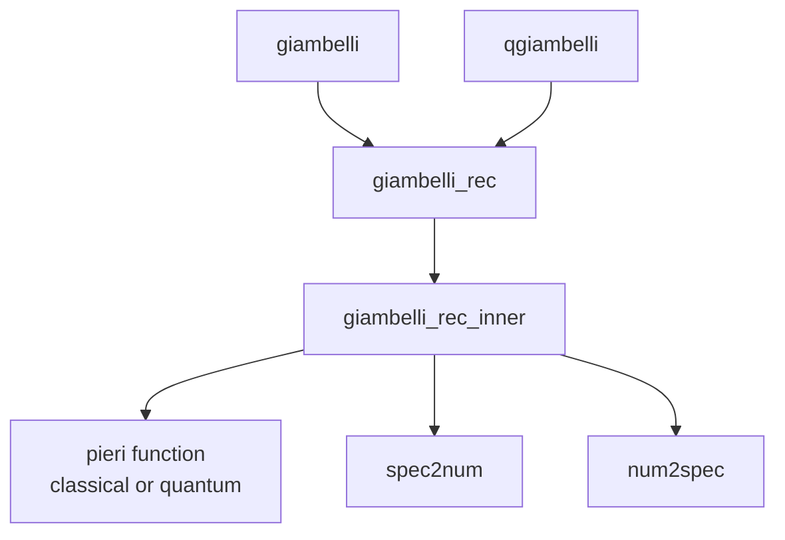

# Thuật Toán Giambelli cho các Grassmannian

Tài liệu này mô tả chi tiết các thuật toán Giambelli được triển khai trong SchubertPy cho tất cả các loại Grassmannian. Quy tắc Giambelli là thuật toán quan trọng để biểu diễn các lớp Schubert tùy ý dưới dạng determinant của các lớp Schubert đặc biệt.

## Tổng Quan

**Ý nghĩa:** Quy tắc Giambelli là công thức chính xác để biểu diễn bất kỳ lớp Schubert $\sigma_\lambda$ nào dưới dạng polynomial của các lớp Schubert đặc biệt (chỉ có một phần).

**Ý tưởng cơ bản:** Dùng thuật toán đệ quy để:
1. Giảm dần từ partition $\lambda$ đầy đủ về các partition đơn giản hơn 
2. Sử dụng quy tắc Pieri để tính các tích cần thiết
3. Áp dụng công thức đệ quy để thu được kết quả cuối cùng

## Quan hệ Algorithm Dependencies



## Thuật Toán Chính: `giambelli(lc)`

### Mô tả
Biểu diễn linear combination của các lớp Schubert dưới dạng polynomial của các lớp Schubert đặc biệt, sử dụng quy tắc Pieri cổ điển.

### Đầu vào
- `lc`: Linear combination của các lớp Schubert (có thể là một partition, Schur class, hoặc tổ hợp phức tạp)

### Đầu ra  
- Polynomial của các lớp Schubert đặc biệt $\sigma_p$ (p > 0) và $\sigma_{p,0}$ (p < 0)

### Thuật Toán
```
Algorithm 1: Giambelli Rule (Classical)
Input: lc ∈ LinearCombination of Schubert classes
Output: Polynomial expression in special Schubert classes

1: pieri ← λ i, p → _pieri(i, p, _k, _n)   ⊳ Classical Pieri function
2: return GiambelliRec(lc, pieri, _k)      ⊳ Recursive computation
```

## Thuật Toán Đệ Quy: `giambelli_rec(lc, pieri, k)`

### Mô tả
Áp dụng thuật toán Giambelli đệ quy cho linear combination, sử dụng function pieri cho trước.

### Thuật Toán
```
Algorithm 2: Giambelli Recursive Driver
Input: lc ∈ LinearCombination, pieri ∈ Function, k ∈ ℕ
Output: Polynomial of special Schubert classes

1: return ApplyLC(λ ↦ GiambelliRecInner(λ, pieri, k), lc)
```

## Thuật Toán Cốt Lõi: `giambelli_rec_inner(lam, pieri, k)`

### Mô tả
Thuật toán đệ quy cốt lõi để biểu diễn một lớp Schubert $\sigma_\lambda$ dưới dạng polynomial của các lớp đặc biệt.

### Công thức toán học
Quy tắc Giambelli dựa trên công thức đệ quy:

$$
\sigma_\lambda = \sigma_p \cdot G(\lambda') - G(\text{stuff})
$$

Trong đó:
- $p = \lambda_1$ (phần tử đầu tiên của $\lambda$)  
- $\lambda' = \lambda[2:]$ (partition con từ phần tử thứ 2)
- $\text{stuff} = \text{pieri}(p, \lambda') - \sigma_\lambda$ (hiệu số để khử $\sigma_\lambda$ từ Pieri expansion)

### Thuật Toán
```
Algorithm 3: Giambelli Recursive Inner Core
Input: λ = (λ₁, λ₂, ..., λₗ) ∈ Partition, pieri ∈ Function, k ∈ ℕ
Output: Polynomial ∈ SpecialSchubertClasses

1: if |λ| = 0 then return 1 end if        ⊳ Base case: empty partition

2: p ← λ₁                                 ⊳ First part
3: if p = k ∧ λₗ = 0 then p ← -k end if   ⊳ Special case for Type D

4: ⊳ Extract sub-partition λ'
5: λ' ← λ[2:]                             ⊳ Default: remove first part
6: if λₗ = 0 ∧ λ₂ < k then                ⊳ Special handling for trailing zero
7:    λ' ← λ[2:-1]                        ⊳ Remove both first and last parts
8: end if

9: ⊳ Compute Pieri expansion and residual
10: pieriExpansion ← pieri(p, λ')
11: stuff ← pieriExpansion - σ_λ           ⊳ Remove target class

12: ⊳ Recursive calls
13: a ← GiambelliRecInner(λ', pieri, k)   ⊳ For sub-partition
14: b ← GiambelliRec(stuff, pieri, k)     ⊳ For residual terms

15: ⊳ Apply Giambelli formula
16: result ← Num2Spec(p) · a - b
17: return Expand(result)
```

### Giải thích chi tiết:

**Base case (line 1):**
- Partition rỗng tương ứng với lớp đơn vị $\sigma_\emptyset = 1$

**Parameter extraction (lines 2-3):**
- Lấy phần tử đầu tiên $p = \lambda_1$ làm "tham số Pieri"  
- Trường hợp đặc biệt Type D: nếu $p = k$ và có trailing zero thì $p = -k$

**Sub-partition computation (lines 5-8):**
- Mặc định: $\lambda' = \lambda[2:]$ (loại bỏ phần tử đầu)
- Đặc biệt: nếu có trailing zero và $\lambda_2 < k$ thì $\lambda' = \lambda[2:-1]$ (loại bỏ cả đầu và cuối)

**Pieri expansion (lines 10-11):**
- Tính $\text{pieri}(p, \lambda')$ để có expansion chứa $\sigma_\lambda$
- $\text{stuff}$ là phần còn lại sau khi trừ đi $\sigma_\lambda$

**Recursion (lines 13-14):**
- $a$: Giambelli cho partition đơn giản hơn $\lambda'$
- $b$: Giambelli cho các terms phức tạp trong $\text{stuff}$

**Final formula (line 16):**
- Công thức Giambelli: $\sigma_\lambda = \sigma_p \cdot G(\lambda') - G(\text{stuff})$
- Rearrange: $G(\sigma_\lambda) = \sigma_p \cdot G(\lambda') - G(\text{stuff})$

## Helper Functions

### 1. `spec2num(sc)`

**Mục đích:** Chuyển đổi lớp Schubert đặc biệt thành tham số số học.

**Thuật toán:**
```
Algorithm 4: Special Schubert to Number
Input: sc ∈ SpecialSchubertClass  
Output: p ∈ ℤ

1: if sc không phải Schubert class then
2:    ERROR("special schubert class expected")
3: end if
4: if |sc| > 1 ∧ (_type ≠ "D" ∨ sc[2] ≠ 0) then
5:    ERROR("single part expected")  
6: end if
7: if |sc| > 1 then return -sc[1]          ⊳ Negative case: σ_{p,0} → -p
8: else return sc[1] end if                ⊳ Positive case: σ_p → p
```

**Ví dụ:**
- $\sigma_3 \rightarrow 3$
- $\sigma_{5,0} \rightarrow -5$ (chỉ cho Type D)

### 2. `num2spec(p)`

**Mục đích:** Chuyển đổi tham số số học thành lớp Schubert đặc biệt.

**Thuật toán:**
```
Algorithm 5: Number to Special Schubert  
Input: p ∈ ℤ
Output: SpecialSchubertClass

1: if p > 0 then return σ_p               ⊳ Positive: simple class
2: else return σ_{-p,0} end if            ⊳ Negative: with trailing zero
```

**Ví dụ:**
- $3 \rightarrow \sigma_3$
- $-5 \rightarrow \sigma_{5,0}$

### 3. `apply_lc(f, lc)`

**Mục đích:** Áp dụng function f lên từng Schubert class trong linear combination.

**Chi tiết:** Xem [Algorithm trong Type A](pieri_typeA_algorithms.md#helper-functions)

## Phiên Bản Lượng Tử: `qgiambelli(lc)`

### Mô tả
Tương tự như Giambelli cổ điển nhưng sử dụng quy tắc Pieri lượng tử, cho phép có tham số q trong kết quả.

### Thuật Toán
```
Algorithm 1: Quantum Giambelli Rule
Input: lc ∈ LinearCombination of Schubert classes
Output: Polynomial in QH* with quantum parameter q

1: qpieri ← λ i, p → _qpieri(i, p, _k, _n)
2: return GiambelliRec(lc, qpieri, _k)
```

### Đặc điểm:
- **Cấu trúc tương tự** classical Giambelli
- **Khác biệt:** Sử dụng `qpieri` thay vì `pieri`
- **Kết quả:** Có thể chứa tham số q với các degrees khác nhau
- **Áp dụng:** Cho tất cả types A, B, C, D

## Ứng Dụng theo Type

### Type A: Grassmannian Gr(k,n)
```
Example: σ_{2,1} in Gr(2,4)
Input: S[2,1]
Algorithm: GiambelliRecInner([2,1], pieriA, k=2)
- p = 2, λ' = [1]
- pieri(2, [1]) = σ_{3} + σ_{2,1} (ví dụ)
- stuff = σ_{3}
- a = GiambelliRecInner([1]) = σ₁
- b = GiambelliRec(σ₃) = σ₃
- result = σ₂ · σ₁ - σ₃
```

### Type B: Orthogonal OG(k,2n+1)
```
Uses: pieriB with coefficients 2^(c-b)
Special handling: Different connected component counting
```

### Type C: Symplectic IG(k,2n)  
```
Uses: pieriC with coefficients 2^c
Special: skipfirst=true in count_comps
```

### Type D: Orthogonal OG(k,2n+2)
```
Uses: pieriD with complex _dcoef
Special cases: 
- p = k with trailing zero → p = -k
- Tie-breaking logic in coefficients
```

## Đặc Điểm Đặc Biệt

### 1. **Memoization**
- Thuật toán sử dụng `@hashable_lru_cache` để cache kết quả
- Quan trọng vì có nhiều đệ quy trùng lặp

### 2. **Universal Algorithm**
- Cùng một thuật toán cho tất cả types
- Khác biệt chỉ ở function `pieri` được truyền vào

### 3. **Trailing Zero Handling**
- Type D có logic đặc biệt cho trailing zeros
- Ảnh hưởng đến cả parameter extraction và sub-partition computation

### 4. **Polynomial Result**
- Kết quả không phải linear combination của partitions
- Mà là polynomial của các special Schubert classes σ_p

## Ví Dụ Chi Tiết

### Ví dụ 1: Giambelli cho $\sigma_{3,1}$ trong Type A
```
Input: σ_{3,1}
Step 1: p = 3, λ' = [1]
Step 2: pieri(3, [1]) = σ_{4} + σ_{3,1} (giả sử)
Step 3: stuff = σ_{4}
Step 4: a = Giambelli([1]) = σ₁
Step 5: b = Giambelli(σ_{4}) = σ₄  
Step 6: result = σ₃ · σ₁ - σ₄
```

### Ví dụ 2: Quantum case với parameter q
```
Input: σ_{2,1} in quantum setting
Result: Có thể có dạng σ₂ · σ₁ - σ₃ + q · (quantum terms)
```

## Tham Khảo

- **Lý thuyết:** Fulton "Young Tableaux", Chapter on Giambelli formula
- **Implementation:** SchubertPy source code
- **Tests:** `test_giambelli()` trong test cases
- **Related:** [Pieri Type A](pieri_typeA_algorithms.md), [Pieri Overview](pieri_algorithms.md)