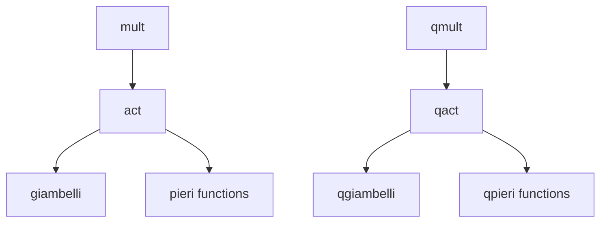

# Thuật Toán Littlewood-Richardson cho các Grassmannian

Tài liệu này mô tả chi tiết các thuật toán Littlewood-Richardson được triển khai trong SchubertPy cho tất cả các loại Grassmannian. Quy tắc Littlewood-Richardson là thuật toán cốt lõi để tính tích của hai lớp Schubert bất kỳ trong vành đồng điều của Grassmannian.

## Tổng Quan

**Ý nghĩa:** Quy tắc Littlewood-Richardson là công thức chính xác để tính tích $\sigma_\lambda \cdot \sigma_\mu$ của hai lớp Schubert và biểu diễn kết quả dưới dạng tổ hợp tuyến tính của các lớp Schubert khác.

**Công thức toán học:**

$$
\sigma_\lambda \cdot \sigma_\mu = \sum_\nu c_\nu^{\lambda\mu} \sigma_\nu
$$

Trong đó $c_\nu^{\lambda\mu}$ là **hệ số Littlewood-Richardson** - số nguyên không âm được tính theo quy tắc tableaux.

**Ý tưởng thuật toán:** Sử dụng kết hợp **Giambelli** và **Pieri**:
1. Áp dụng quy tắc Giambelli để biểu diễn $\sigma_\lambda$ dưới dạng polynomial của các lớp đặc biệt
2. Sử dụng quy tắc Pieri để "tác động" polynomial này lên $\sigma_\mu$
3. Thu được kết quả cuối cùng là tích $\sigma_\lambda \cdot \sigma_\mu$

## Quan hệ Algorithm Dependencies



## Thuật Toán Chính: `mult(lc1, lc2)`

### Mô tả
Tính tích của hai lớp Schubert (hoặc tổ hợp tuyến tính của chúng) trong vành đồng điều cổ điển của Grassmannian.

### Đầu vào
- `lc1`: Linear combination đầu tiên ($\sigma_\lambda$ hoặc tổ hợp phức tạp)
- `lc2`: Linear combination thứ hai ($\sigma_\mu$ hoặc tổ hợp phức tạp)

### Đầu ra
- Tích `lc1 · lc2` dưới dạng tổ hợp tuyến tính các lớp Schubert

### Thuật toán
```
Algorithm 1: Littlewood-Richardson Multiplication (Classical)
Input: lc1, lc2 ∈ LinearCombination of Schubert classes  
Output: Product lc1 · lc2 as LinearCombination

1: lc1 ← LinearCombination(lc1)           ⊳ Normalize inputs
2: lc2 ← LinearCombination(lc2)
3: polynomial ← Giambelli(lc1)            ⊳ Convert to polynomial of special classes
4: result ← Act(polynomial, lc2)          ⊳ Apply polynomial to lc2 via Pieri rules
5: return result
```

## Thuật Toán Core: `act(expr, lc)`

### Mô tả
Tác động một polynomial expression (của các lớp đặc biệt) lên một linear combination thông qua quy tắc Pieri.

### Thuật toán
```
Algorithm 2: Action of Polynomial via Pieri Rules
Input: expr ∈ Polynomial of special Schubert classes, lc ∈ LinearCombination
Output: Result of applying expr to lc

1: expr ← LinearCombination(expr).expr     ⊳ Extract sympy expression
2: lc ← LinearCombination(lc)
3: pieri_func ← λ(i,p) → _pieri(i, p, _k, _n)  ⊳ Classical Pieri function
4: return ActLC(expr, lc, pieri_func)      ⊳ Core action algorithm
```

## Thuật Toán Cốt Lõi: `act_lc(expr, lc, pieri)`

### Mô tả
Thuật toán đệ quy để tác động một expression polynomial lên linear combination bằng cách phân tích từng variable trong expression và áp dụng quy tắc Pieri tương ứng.

### Thuật toán
```
Algorithm 3: Action Linear Combination Core
Input: expr ∈ Polynomial expression, lc ∈ LinearCombination, pieri ∈ Function
Output: Result of action

1: vars ← Variables(expr) \ {q}            ⊳ Extract variables except quantum parameter
2: if |vars| = 0 then return expr · lc    ⊳ Base case: no variables left

3: v ← vars[1]                             ⊳ Pick first variable  
4: i ← Spec2Num(v)                         ⊳ Convert special class to parameter

5: ⊳ Split expression: expr = expr₀ + v · expr₁
6: expr₀ ← Substitute(expr, v=0)           ⊳ Constant part
7: expr₁ ← (expr - expr₀) / v              ⊳ Coefficient of v

8: ⊳ Recursive calls
9: term1 ← ApplyLC(p → pieri(i,p), ActLC(expr₁, lc, pieri))  ⊳ Apply Pieri to v·expr₁ part
10: term2 ← ActLC(expr₀, lc, pieri)        ⊳ Handle constant part
11: return term1 + term2
```

### Giải thích chi tiết:

**Base case (line 2):**
- Khi không còn variable nào trong expression, chỉ cần nhân scalar với linear combination

**Variable extraction (lines 3-4):**
- Lấy variable đầu tiên (đại diện cho lớp Schubert đặc biệt σᵢ)
- Chuyển đổi thành parameter i thông qua `spec2num`

**Expression splitting (lines 6-7):**
- Tách expression thành: `expr = expr₀ + v · expr₁`
- `expr₀`: phần không chứa v
- `expr₁`: hệ số của v

**Recursive computation (lines 9-11):**
- `term1`: Áp dụng Pieri rule σᵢ lên kết quả của đệ quy `expr₁`  
- `term2`: Xử lý phần constant `expr₀`
- Kết quả cuối cùng là tổng của hai phần

## Thuật Toán Quantum: `qmult(lc1, lc2)`

### Mô tả
Tương tự như `mult` nhưng trong vành đồng điều lượng tử, cho phép có tham số quantum `q` trong kết quả.

### Thuật toán
```
Algorithm 4: Quantum Littlewood-Richardson Multiplication
Input: lc1, lc2 ∈ LinearCombination of Schubert classes
Output: Quantum product lc1 · lc2 with possible q-terms

1: lc1 ← LinearCombination(lc1)
2: lc2 ← LinearCombination(lc2)  
3: q_polynomial ← QGiambelli(lc1)         ⊳ Quantum Giambelli formula
4: result ← QAct(q_polynomial, lc2)       ⊳ Quantum action via qpieri rules
5: return result
```

## Ví Dụ Chi Tiết

### Ví dụ 1: Type A - Grassmannian Gr(2,4)
```
Input: mult(σ_{2,1}, σ_{1})
Step 1: giambelli(σ_{2,1}) = σ₂ · σ₁ - σ₃  (giả sử)
Step 2: act(σ₂ · σ₁ - σ₃, σ_{1})
      = σ₂ · pieri(1, σ_{1}) - pieri(3, σ_{1})
      = σ₂ · (σ_{2} + σ_{1,1}) - 0
      = σ₂ · σ_{2} + σ₂ · σ_{1,1}
Step 3: Tiếp tục áp dụng đệ quy...
Final: σ_{2,2} (ví dụ)
```

### Ví dụ 2: Type C - Isotropic Grassmannian IG(2,6)  
```
Input: mult(σ_{2,1}, σ_{2,1})
Result: 2·σ_{4,2} (có hệ số 2 do đặc trưng Type C)
```

### Ví dụ 3: Quantum case
```
Input: qmult(σ_{2,1}, σ_{1}) in Gr(2,4)
Result: σ_{2,2} + q·(quantum_terms)
```

## Đặc Điểm theo Type

### Type A: Grassmannian Gr(k,n)
- **Hệ số:** Luôn là số nguyên dương
- **Quantum terms:** Có thể xuất hiện q với degree = n
- **Đặc trưng:** Quy tắc Pieri đơn giản nhất

### Type B: Orthogonal OG(k,2n+1)  
- **Hệ số:** Thường là lũy thừa của 2
- **Quantum terms:** Degree q = n+k hoặc 2n
- **Đặc trưng:** Component counting với coefficient 2^c

### Type C: Symplectic IG(k,2n)
- **Hệ số:** Lũy thừa của 2 với skipfirst logic
- **Quantum terms:** Degree q = n+1+k  
- **Đặc trưng:** Count_comps với skipfirst=True

### Type D: Orthogonal OG(k,2n+2)
- **Hệ số:** Phức tạp nhất với tie-breaking rules
- **Quantum terms:** Multiple quantum parameters q, q1, q2
- **Đặc trưng:** Special handling cho trailing zeros


## So Sánh với Lý Thuyết

### Classical Littlewood-Richardson
- **Tableaux method:** Đếm số cách fill Young tableaux
- **SchubertPy approach:** Dùng Giambelli + Pieri thay vì direct tableaux

## Test Cases và Validation

### Unit Tests
- **Basic multiplication:** Các trường hợp đơn giản σᵢ · σⱼ
- **Commutativity:** Verify mult(a,b) = mult(b,a) 
- **Associativity:** Verify mult(mult(a,b),c) = mult(a,mult(b,c))
- **Identity:** mult(σ₀, a) = a

### Integration Tests  
- **Cross-type verification:** So sánh kết quả giữa các types
- **Quantum vs Classical:** Verify quantum specializes to classical khi q=0
- **Large examples:** Performance testing với partitions lớn

## Tham Khảo

- **[Giambelli Algorithms](giambelli_algorithms.md)** - Thuật toán Giambelli được sử dụng
- **[Pieri Type A](pieri_typeA_algorithms.md)** - Quy tắc Pieri cho Type A
- **[Pieri Overview](pieri_algorithms.md)** - Tổng quan quy tắc Pieri tất cả types
- **Lý thuyết:** Fulton "Intersection Theory", Manivel "Symmetric Functions, Schubert Polynomials"
- **Implementation:** SchubertPy source code trong `abstract_grassmannian.py`
- **Examples:** `example/main.py` và các test cases 