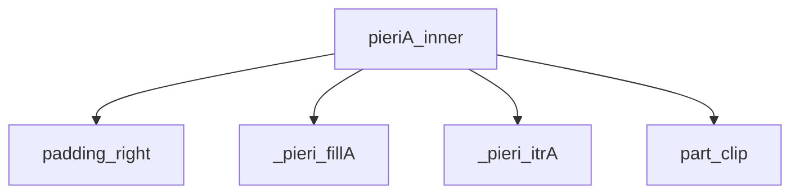
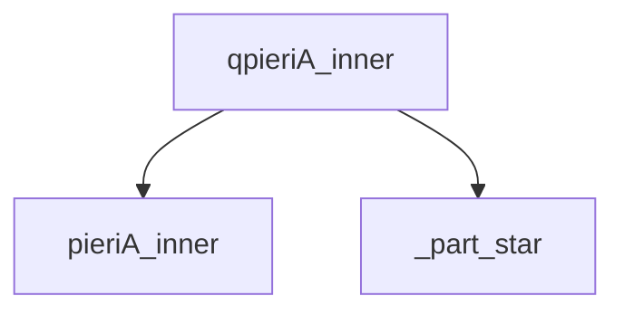

# Thuật Toán Pieri Type A cho Grassmannian Thông Thường

Tài liệu này mô tả chi tiết các thuật toán quy tắc Pieri Type A được triển khai trong SchubertPy cho Grassmannian thông thường Gr(k,n).

## Tổng Quan

Quy tắc Pieri Type A là thuật toán cơ bản để nhân một lớp Schubert với một lớp Schubert đặc biệt (tương ứng với một hàng đơn trong biểu đồ Young) trên Grassmannian thông thường.

## Quan hệ các Algorithm liên quan đến Pieri A (Dependencies Tree)



### Quan hệ các Algorithm liên quan đến Quantum Pieri A (Dependencies Tree)



## Thuật Toán Chính: `pieriA_inner(i, lam, k, n)`

### Mô tả
Tính toán tích Pieri của một lớp Schubert với lớp Schubert đặc biệt có kích thước i trong cohomology ring của Grassmannian Gr(k,n).

### Đầu vào
- `i`: Kích thước của lớp Schubert đặc biệt (hàng đơn)
- `lam`: Phân hoạch biểu diễn lớp Schubert gốc
- `k`: Tham số đồng chiều (số lượng subspace)  
- `n`: Tham số chiều (chiều của không gian vector)

### Đầu ra
- Tổng tuyến tính của các lớp Schubert $\sigma_\mu \in H^*(Gr(k,n))$

### Thuật toán
```
Algorithm 1: Pieri Rule Type A
Input: i ∈ ℕ, λ = (λ₁, λ₂, ..., λₗ), k, n ∈ ℕ
Output: ∑ σ_μ ∈ H*(Gr(k,n))

1: λ_pad ← λ ∪ {0}^(n-k-|λ|)               ⊳ Padding với zeros (padding_right)
2: inner ← λ_pad
3: outer ← (k, λ_pad₁, λ_pad₂, ..., λ_pad_{n-k-1}) ⊳ Thiết lập ranh giới
4: result ← 0
5: μ ← PieriFillA(inner, outer, 0, i)       ⊳ Cấu hình đầu tiên (_pieri_fillA)
6: while μ ≠ ∅ do
7:    result ← result + σ_{trim(μ)}         ⊳ Thêm vào kết quả (part_clip)
8:    μ ← PieriIterA(μ, inner, outer)       ⊳ Cấu hình tiếp theo (_pieri_itrA)
9: end while
10: return result
```

## Thuật Toán Hỗ Trợ

### 1. `padding_right(lam, value, count)`

**Mục đích:** Thêm padding vào bên phải của partition để đạt độ dài cần thiết.

**Thuật toán:**
```
Algorithm 1.1: Padding Right
Input: λ ∈ Partition, value ∈ ℕ, count ∈ ℕ  
Output: λ' ∈ Partition

1: λ' ← λ ∪ {value}^count                   ⊳ Thêm count phần tử có giá trị value
2: return λ'
```

### 2. `_pieri_fillA(lam, inner, outer, row_index, p)`

**Mục đích:** Tạo cấu hình đầu tiên cho thuật toán Pieri Type A bằng cách điền boxes vào Young diagram.

**Thuật toán:**
```
Algorithm 1.2: Pieri Fill Type A
Input: λ, inner, outer ∈ Partitions, row_index, p ∈ ℕ
Output: μ ∈ Partition ∪ {∅}

1: if λ = ∅ then return λ end if
2: res ← λ.copy()
3: pp ← p
4: rr ← row_index
5: if rr = 0 then                          ⊳ Hàng đầu tiên
6:    x ← min(outer[0], inner[0] + pp)
7:    res[0] ← x
8:    pp ← pp - x + inner[0]
9:    rr ← 1
10: end if
11: while rr < |λ| do                      ⊳ Xử lý các hàng còn lại
12:   x ← min(outer[rr], inner[rr] + pp, res[rr-1])
13:   res[rr] ← x
14:   pp ← pp - x + inner[rr]
15:   rr ← rr + 1
16: end while
17: if pp > 0 then return ∅ end if        ⊳ Không thể đặt hết boxes
18: return res[:|λ|]
```

### 3. `_pieri_itrA(lam, inner, outer)`

**Mục đích:** Tạo cấu hình tiếp theo trong việc liệt kê tất cả các Young diagrams hợp lệ.

**Thuật toán:**
```
Algorithm 1.3: Pieri Iterator Type A
Input: λ, inner, outer ∈ Partitions
Output: μ ∈ Partition ∪ {∅}

1: if λ = ∅ then return ∅ end if
2: p ← λ_{|λ|} - inner_{|λ|}               ⊳ Boxes ở hàng cuối
3: for r ← |λ|-1 down to 1 do              ⊳ Duyệt ngược từ hàng áp cuối
4:    if λ[r] > inner[r] then              ⊳ Có thể giảm hàng này
5:       μ ← λ.copy()
6:       μ[r] ← μ[r] - 1
7:       μ ← PieriFillA(μ, inner, outer, r+1, p+1)
8:       if μ ≠ ∅ then return μ end if
9:    end if
10:   p ← p + λ[r] - inner[r]              ⊳ Cộng dồn boxes
11: end for
12: return ∅                               ⊳ Không còn cấu hình nào
```

### 4. `part_clip(lambda)`

**Mục đích:** Loại bỏ các số 0 ở cuối partition để chuẩn hóa kết quả.

**Thuật toán:**
```
Algorithm 1.4: Trim Trailing Zeros
Input: λ = (λ₁, λ₂, ..., λₗ) ∈ Sequence
Output: λ' ∈ Partition

1: i ← |λ|                                ⊳ Bắt đầu từ cuối
2: while i > 0 ∧ λ[i-1] = 0 do           ⊳ Tìm phần tử cuối khác 0
3:    i ← i - 1
4: end while
5: if i = 0 then return ∅ end if          ⊳ Tất cả đều là 0
6: return (λ₁, λ₂, ..., λᵢ)
```

### 5. `_part_star(lam, cols)`

**Mục đích:** Kiểm tra và biến đổi partition theo điều kiện lượng tử trong Pieri Type A.

**Thuật toán:**
```
Algorithm 1.5: Part Star Operation
Input: λ = (λ₁, λ₂, ..., λₗ) ∈ Partition, cols ∈ ℕ
Output: Schur ∪ {0}

1: if λ = ∅ ∨ λ₁ ≠ cols then          ⊳ Kiểm tra điều kiện
2:    return 0                         ⊳ Không thỏa mãn điều kiện
3: end if
4: if |λ| = 1 then                     ⊳ Chỉ có một phần tử
5:    return σ_∅                       ⊳ Trả về Schur rỗng
6: end if
7: return σ_(λ₂,λ₃,...,λₗ)              ⊳ Loại bỏ phần tử đầu tiên
```

**Ý nghĩa toán học:**
- Function này kiểm tra xem phần tử đầu tiên của partition có bằng `cols` không
- Nếu đúng, loại bỏ phần tử đầu tiên và trả về partition còn lại
- Nếu sai, trả về 0 (không đóng góp vào kết quả)
- Được sử dụng trong quantum corrections của quy tắc Pieri

## Phiên Bản Lượng Tử: `qpieriA_inner(i, lam, k, n)`

### Mô tả
Tính toán tích Pieri trong quantum cohomology ring của Grassmannian, bao gồm cả số hạng cổ điển và số hạng lượng tử.

### Thuật toán
```
Algorithm 2: Quantum Pieri Rule Type A
Input: i ∈ ℕ, λ = (λ₁, λ₂, ..., λₗ), k, n ∈ ℕ
Output: ∑ a_μ σ_μ + ∑ b_ν q^d σ_ν ∈ QH*(Gr(k,n))

1: result ← PieriA(i, λ, k, n)              ⊳ Số hạng cổ điển
2: if |λ| = n-k ∧ λ_{n-k} > 0 then         ⊳ Điều kiện lượng tử
3:    if k = 1 then
4:       return q · σ_∅
5:    end if
6:    λ' ← {λⱼ - 1 : λⱼ > 1, j ∈ [1,|λ|]}   ⊳ Tạo partition mới
7:    LC ← PieriA(i-1, λ', k-1, n)          ⊳ Tính linear combination cổ điển
8:    Z ← ApplyLC(μ ↦ _part_star(μ, k-1), LC) ⊳ Áp dụng _part_star lên mỗi hạng tử
9:    result ← result + q · Z               ⊳ Thêm số hạng lượng tử
10: end if
11: return result
```

### Giải thích chi tiết:

**Bước 8 - ApplyLC Operation:**
- `LC` là một linear combination có dạng: `∑ cᵢ σ_μᵢ`
- `ApplyLC(f, LC)` áp dụng function `f` lên từng partition μᵢ trong LC một cách đệ quy
- Nếu `f(μᵢ)` trả về một Schur function, thì kết quả là symbol của nó
- Nếu `f(μᵢ)` trả về một LinearCombination, thì kết quả là expression của nó
- Kết quả cuối cùng: `∑ cᵢ · f(μᵢ)` với cấu trúc đầy đủ được bảo toàn

**Ví dụ:** Nếu `LC = 2σ_(1,1) + 3σ_(2)` và `f = μ ↦ _part_star(μ, 1)`, thì:
```
ApplyLC(f, LC) = 2·_part_star((1,1),1) + 3·_part_star((2),1)
                = 2·σ_result1 + 3·σ_result2 (tùy thuộc vào _part_star output)
```

**Lưu ý quan trọng:**
- `ApplyLC` không chỉ áp dụng function một lần, mà đệ quy xử lý toàn bộ cấu trúc
- Coefficients và các phép toán (cộng, nhân) trong LC được bảo toàn
- Chỉ các Schur functions (partitions) được transform bởi function `f`

## Độ Phức Tạp

- **Thời gian:** O(số lượng partitions hợp lệ × độ dài trung bình partition)
- **Không gian:** O(độ dài tối đa partition)

## Ký Hiệu

- **$\sigma_\mu$**: Lớp Schubert tương ứng với partition $\mu$
- **q**: Tham số lượng tử
- **Gr(k,n)**: Grassmannian thông thường  
- **$H^*(Gr(k,n))$**: Cohomology ring của Gr(k,n)
- **$QH^*(Gr(k,n))$**: Quantum cohomology ring của Gr(k,n)
- **$\lambda \subseteq \mu$**: $\mu$ chứa $\lambda$ (componentwise $\leq$)
- **$|\lambda|$**: Số hàng của partition $\lambda$
- **$\emptyset$**: Partition rỗng

## Ví Dụ và Ứng Dụng

### Ví Dụ Tóm Tắt

#### Classical Pieri trong Gr(2,4)
```
Input: pieriA_inner(i=1, lam=[1], k=2, n=4)
Output: S[1,1] + S[2]
Ý nghĩa: σ_(1) * σ_1 = σ_(2) + σ_(1,1)
```

#### Quantum Pieri với quantum correction
```
Input: qpieriA_inner(i=1, lam=[2,2], k=2, n=4) 
Output: S[1]*q
Ý nghĩa: Khi partition đạt "boundary", xuất hiện quantum term
```

### Tài Liệu Ví Dụ Chi Tiết

📖 **[Xem tất cả ví dụ chi tiết với kết quả thực tế →](./pieri_typeA_examples.md)**

Tài liệu ví dụ bao gồm:
- Ví dụ cho từng thuật toán hỗ trợ với input/output cụ thể
- Ví dụ classical và quantum Pieri với nhiều trường hợp
- So sánh kết quả classical vs quantum
- Interface examples qua Grassmannian class

## Tham Khảo

- **Ví dụ chi tiết:** [Pieri Type A Examples](./pieri_typeA_examples.md)
- **Test code:** [`test_pieri_examples.py`](../test_pieri_examples.py)
- **SchubertPy documentation:** [Main repository](../README.md) 