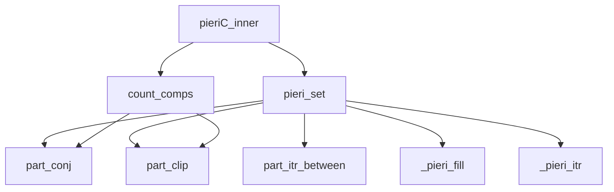
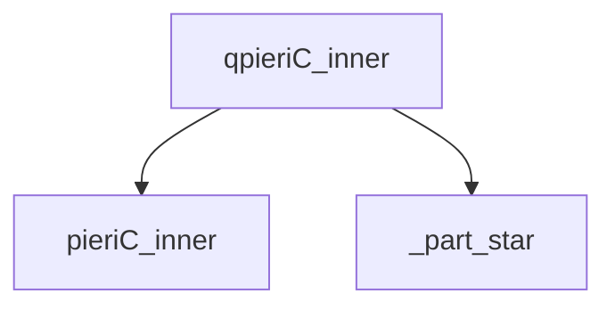

# Thuật Toán Pieri Type C cho Grassmannian Symplectic 

Tài liệu này mô tả chi tiết các thuật toán quy tắc Pieri Type C được triển khai trong SchubertPy cho Grassmannian symplectic (isotropic) IG(k,2n).

📘 **[Ví dụ chi tiết và test cases ← Pieri Type C Examples](./pieri_typeC_examples.md)**  
📘 **[So sánh với Type A ← Pieri Type A Algorithms](./pieri_typeA_algorithms.md)**  
📘 **[So sánh với Type B ← Pieri Type B Algorithms](./pieri_typeB_algorithms.md)**  
📘 **[Test code thực tế ← test_pieri_C_examples.py](../test_pieri_C_examples.py)**

## Tổng Quan

Quy tắc Pieri Type C là thuật toán để nhân một lớp Schubert với một lớp Schubert đặc biệt trên Grassmannian symplectic IG(k,2n). Type C có đặc điểm riêng về connected components counting với `skipfirst=true` và quantum corrections đơn giản hơn Type B.

## Quan hệ các Algorithm liên quan đến Pieri C (Dependencies Tree)



### Quan hệ các Algorithm liên quan đến Quantum Pieri C (Dependencies Tree)



## Thuật Toán Chính: `pieriC_inner(i, lam, k, n)`

### Mô tả
Tính toán tích Pieri của một lớp Schubert với lớp Schubert đặc biệt có kích thước i trong cohomology ring của Grassmannian symplectic IG(k,2n).

### Đầu vào
- `i`: Kích thước của lớp Schubert đặc biệt
- `lam`: Phân hoạch biểu diễn lớp Schubert gốc
- `k`: Tham số đồng chiều (số lượng subspace)  
- `n`: Tham số chiều (liên quan đến chiều không gian 2n)

### Đầu ra
- Tổng tuyến tính của các lớp Schubert $\sum 2^{c(\lambda,\mu)} \sigma_\mu \in H^*(IG(k,2n))$

### Thuật toán
```
Algorithm 1: Pieri Rule Type C
Input: i ∈ ℕ, λ = (λ₁, λ₂, ..., λₗ), k, n ∈ ℕ
Output: ∑ 2^c(λ,μ) σ_μ ∈ H*(IG(k,2n))

1: result ← 0
2: 𝒫 ← PieriSet(i, λ, k, n, 0)             ⊳ Tập partitions hợp lệ  
3: for each μ ∈ 𝒫 do
4:    c ← CountComps(λ, μ, true, k, 0)      ⊳ Đếm connected components (skipfirst=true)
5:    aμ ← 2^c                             ⊳ Hệ số với lũy thừa của 2 (không có offset)
6:    result ← result + aμ · σμ
7: end for
8: return result
```

## Thuật Toán Hỗ Trợ

### 1. `pieri_set(i, lam, k, n, 0)` 

**Mục đích và Thuật toán**: Tương tự [Algorithm 1.1 trong Type B](pieri_typeB_algorithms.md#1-pieri_setp-lam-k-n-d) với `d=0`.

### 2. `count_comps(lam1, lam2, true, k, 0)`

**Mục đích:** Đếm số connected components với `skipfirst=true` (khác với Type B).

**Thuật toán:** Tương tự [Algorithm 1.2 trong Type B](pieri_typeB_algorithms.md#2-count_compslam1-lam2-skipfirst-k-d) nhưng với `skipfirst=true` ở bước 34.

### 3. Helper Functions

**Type C sử dụng cùng các helper functions như Type B:**
- `_pieri_fill`: [Algorithm 1.3 trong Type B](pieri_typeB_algorithms.md#3-_pieri_filllam-inner-outer-r-p)
- `_pieri_itr`: [Algorithm 1.4 trong Type B](pieri_typeB_algorithms.md#4-_pieri_itrlam-inner-outer)  
- `part_conj`, `part_clip`, `part_itr_between`: [Xem Type A và Type B](pieri_typeB_algorithms.md#5-common-helper-functions)

### 4. `_part_star(lam, cols)`

**Mục đích và Thuật toán**: Xem [Algorithm 1.5 trong Type A](pieri_typeA_algorithms.md#5-_part_starlam-cols).

## Phiên Bản Lượng Tử: `qpieriC_inner(i, lam, k, n)`

### Mô tả
Tính toán tích Pieri trong quantum cohomology ring của Grassmannian symplectic, đơn giản hơn Type B với chỉ một quantum correction term.

### Thuật toán
```
Algorithm 2: Quantum Pieri Rule Type C
Input: i ∈ ℕ, λ = (λ₁, λ₂, ..., λₗ), k, n ∈ ℕ
Output: ∑ aμ σμ + ∑ bν q^d σν ∈ QH*(IG(k,2n))

1: result ← PieriC(i, λ, k, n)              ⊳ Số hạng cổ điển
2: T₁ ← ApplyLC(μ ↦ _part_star(μ, n+k+1), PieriC(i, λ, k, n+1))
3: result ← result + (q/2) · T₁             ⊳ Quantum term với hệ số q/2
4: return result
```

### Giải thích chi tiết:

**Đặc điểm Type C:**
- Sử dụng hệ số **2^c** (không có offset như Type B)
- Component counting với **skipfirst=true**
- **Quantum correction đơn giản**: Chỉ có một term với hệ số `q/2`
- Không có điều kiện phức tạp như Type B (k=0 vs k>0)

**Quantum correction:**
- **Luôn có**: Một quantum term với `_part_star(μ, n+k+1)`
- **Hệ số đặc biệt**: `q/2` thay vì `q` như các types khác
- **Recursive call**: `PieriC(i, λ, k, n+1)` (tăng n lên 1)

**Sự khác biệt với Type B:**
- Type B: Có điều kiện k=0 vs k>0, hai loại quantum terms
- Type C: Không có điều kiện, chỉ một quantum term đơn giản

## Ví Dụ và Ứng Dụng

### Ví dụ 1: IG(1,4) (k=1, n=2)
Xét việc nhân σ_(1) với lớp Schubert đặc biệt có kích thước i=1:

```
Input: i = 1, λ = (1), k = 1, n = 2
Classical: Tính PieriC(1, (1), 1, 2) với hệ số 2^c (skipfirst=true)
Quantum: Luôn có q/2·ApplyLC(_part_star(·,4), PieriC(1, (1), 1, 3))
Output: Classical terms + quantum terms
```

### Ví dụ 2: Hệ số đặc biệt q/2
```
Input: i = 2, λ = (2,1), k = 1, n = 2
Classical: PieriC(2, (2,1), 1, 2)  
Quantum: q/2·ApplyLC(_part_star(·,4), PieriC(2, (2,1), 1, 3))
Note: Hệ số q/2 là đặc trưng của Type C
```

### Tài Liệu Ví Dụ Chi Tiết

📖 **[Xem tất cả ví dụ chi tiết với kết quả thực tế →](./pieri_typeC_examples.md)**

Tài liệu ví dụ bao gồm:
- Ví dụ cho từng thuật toán hỗ trợ với input/output cụ thể
- Ví dụ classical và quantum Pieri với nhiều trường hợp
- So sánh kết quả với Type A, B, D
- Interface examples qua IsotropicGrassmannian class
- Demonstration của skipfirst=True và quantum coefficient q/2

## Độ Phức Tạp

- **Thời gian:** O(|pieri_set| × độ phức tạp count_comps)
- **Không gian:** O(số lượng partitions trong kết quả)
- **Đơn giản hơn Type B**: Quantum part chỉ có một term

## So Sánh với Type A và Type B

| Khía cạnh | Type A | Type B | Type C |
|-----------|--------|--------|--------|
| Hệ số | 1 | 2^(c-b) | 2^c |
| Skipfirst | N/A | false | true |
| Quantum corrections | 1 loại (điều kiện) | 2 loại (k=0 vs k>0) | 1 loại (luôn có) |
| Quantum coefficient | q | q, q² | q/2 |
| Helper functions | _part_star | _part_star + _part_tilde | _part_star |
| Complexity | Thấp | Cao | Trung bình |

## Đặc Điểm Đặc Biệt của Type C

### 1. **Skipfirst=true**
- Type C sử dụng `skipfirst=true` trong `count_comps`
- Ảnh hưởng đến cách đếm connected components
- Khác với Type B (skipfirst=false)

### 2. **Hệ số q/2**
- Quantum correction có hệ số `q/2` thay vì `q`
- Đặc trưng riêng của symplectic geometry
- Phản ánh cấu trúc đặc biệt của IG(k,2n)

### 3. **Đơn giản hóa**
- Không có phân nhánh k=0 vs k>0 như Type B
- Luôn có quantum correction (không điều kiện)
- Chỉ sử dụng `_part_star`, không cần `_part_tilde`

## Ý Nghĩa Hình học

**Grassmannian Symplectic IG(k,2n):**
- Không gian các k-dimensional isotropic subspaces trong ℂ^(2n)
- Cấu trúc symplectic tạo ra đặc điểm riêng trong quantum cohomology
- Hệ số q/2 phản ánh "half" của cấu trúc symplectic

## Ký Hiệu

- **$\sigma_\mu$**: Lớp Schubert tương ứng với partition $\mu$
- **q**: Tham số lượng tử
- **cc**: Connected components count  
- **$c(\lambda,\mu)$**: Số connected components giữa partitions $\lambda$ và $\mu$
- **IG(k,2n)**: Isotropic Grassmannian (symplectic)
- **$QH^*(IG(k,2n))$**: Quantum cohomology ring của IG(k,2n)
- **H*(IG(k,2n))**: Cohomology ring của IG(k,2n) 