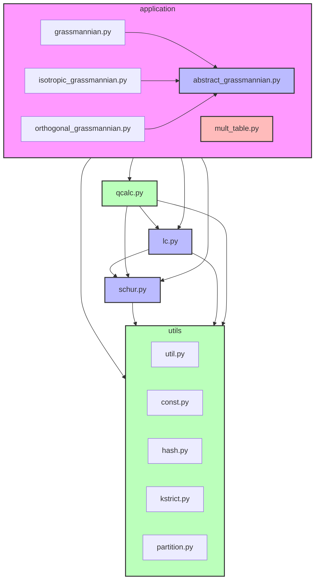

# SchubertPy Module Dependencies

## Module Import Structure

## Module Descriptions

### Application Modules
1. **`abstract_grassmannian.py`**
   - Abstract base class for all Grassmannians
   - Imports from: schur, lc, qcalc

2. **`grassmannian.py`**
   - Type A Grassmannian implementation
   - Imports from: abstract_grassmannian, schur, lc, qcalc

3. **`isotropic_grassmannian.py`**
   - Type C Grassmannian implementation
   - Imports from: abstract_grassmannian

4. **`orthogonal_grassmannian.py`**
   - Type B/D Grassmannian implementation
   - Imports from: abstract_grassmannian

5. **`mult_table.py`**
   - Multiplication table implementation
   - Imports from: lc, abstract_grassmannian

### Base Classes
1. **`schur.py`**
   - Schur class implementation
   - Imports from: const, util, qcalc

2. **`lc.py`**
   - LinearCombination class
   - Imports from: util, schur, const

### Utility Modules
1. **`qcalc.py`**
   - Quantum calculator implementation
   - Imports from: hash, util, schur, lc, kstrict

2. **`util.py`**
   - General utility functions
   - No internal imports

3. **`const.py`**
   - Constants and encoding functions
   - No internal imports

4. **`hash.py`**
   - Hash-related utilities
   - No internal imports

5. **`kstrict.py`**
   - K-strict partition utilities
   - No internal imports

6. **`partition.py`**
   - Partition class and operations
   - Imports from: qcalc, hash

## Circular Dependencies

The project has some circular dependencies that need to be handled carefully:

1. **`schur.py` ↔ `qcalc.py`**
   - `schur.py` imports from `qcalc.py`
   - `qcalc.py` imports from `schur.py`

2. **`lc.py` ↔ `qcalc.py`**
   - `lc.py` imports from `qcalc.py`
   - `qcalc.py` imports from `lc.py`

These circular dependencies are managed through:
- Lazy imports where possible
- Careful module organization
- Utility functions in appropriate modules

## Import Best Practices

1. **Use Relative Imports**
   - All internal imports use relative imports (e.g., `from . import`)
   - Helps maintain package structure

2. **Minimize Dependencies**
   - Each module imports only what it needs
   - Utility functions are placed in appropriate modules

3. **Handle Circular Dependencies**
   - Use lazy imports where necessary
   - Consider restructuring to avoid circular dependencies
   - Document circular dependencies clearly

4. **Module Organization**
   - Core functionality in main modules
   - Utilities in separate modules
   - Clear separation of concerns 