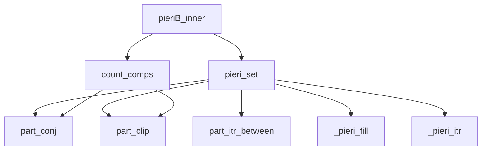
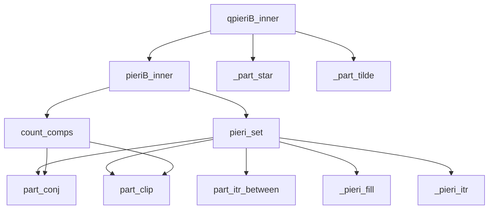

# Thuật Toán Pieri Type B cho Grassmannian Trực Giao Lẻ

Tài liệu này mô tả chi tiết các thuật toán quy tắc Pieri Type B được triển khai trong SchubertPy cho Grassmannian trực giao lẻ OG(k,2n+1).

## Tổng Quan

Quy tắc Pieri Type B là thuật toán để nhân một lớp Schubert với một lớp Schubert đặc biệt trên Grassmannian trực giao lẻ OG(k,2n+1). Khác với Type A, Type B sử dụng hệ số với lũy thừa của 2 và có cơ chế đếm connected components phức tạp hơn.

## Quan hệ các Algorithm liên quan đến Pieri B (Dependencies Tree)



### Quan hệ các Algorithm liên quan đến Quantum Pieri B (Dependencies Tree)



## Thuật Toán Chính: `pieriB_inner(p, lam, k, n)`

### Mô tả
Tính toán tích Pieri của một lớp Schubert với lớp Schubert đặc biệt có kích thước p trong cohomology ring của Grassmannian trực giao lẻ OG(k,2n+1).

### Đầu vào
- `p`: Kích thước của lớp Schubert đặc biệt
- `lam`: Phân hoạch biểu diễn lớp Schubert gốc
- `k`: Tham số đồng chiều (số lượng subspace)  
- `n`: Tham số chiều (liên quan đến chiều không gian 2n+1)

### Đầu ra
- Tổng tuyến tính của các lớp Schubert ∑ 2^(c(λ,μ)-b) σ_μ ∈ H*(OG(k,2n+1))

### Thuật toán
```
Algorithm 1: Pieri Rule Type B
Input: p ∈ ℕ, λ = (λ₁, λ₂, ..., λₗ), k, n ∈ ℕ
Output: ∑ 2^(c(λ,μ)-b) σ_μ ∈ H*(OG(k,2n+1))

1: result ← 0
2: b ← {0 if p ≤ k                         ⊳ Offset cho component counting
        {1 if p > k
3: 𝒫 ← PieriSet(p, λ, k, n, 0)             ⊳ Tập partitions hợp lệ
4: for each μ ∈ 𝒫 do
5:    c ← CountComps(λ, μ, false, k, 0)     ⊳ Đếm connected components
6:    aμ ← 2^(c-b)                         ⊳ Hệ số với lũy thừa của 2
7:    result ← result + aμ · σμ
8: end for
9: return result
```

## Thuật Toán Hỗ Trợ

### 1. `pieri_set(p, lam, k, n, d)`

**Mục đích:** Tạo tập hợp tất cả các partitions hợp lệ trong quy tắc Pieri Type B.

**Thuật toán:**
```
Algorithm 1.1: Pieri Set Generation  
Input: p, k, n, d ∈ ℕ, λ ∈ Partition
Output: 𝒫 ⊆ {Partitions}

1: rows ← n + d - k, cols ← n + k
2: top ← PartConj([min(λᵢ, k) : i ∈ [1,|λ|]])  ⊳ Top part of PR pair
3: top ← top ∪ {0}^(k-|top|)                    ⊳ Padding to length k
4: bot ← PartClip([max(0, λᵢ-k) : i ∈ [1,|λ|]]) ⊳ Bottom part
5: bot ← bot ∪ {0}                              ⊳ Add sentinel
6: 
7: ⊳ Find bounds for new top partition
8: outer ← [min(rows, topⱼ+1) : j ∈ [1,k]]
9: inner ← ComputeInnerBounds(top, bot, k, d)
10:
11: 𝒫 ← ∅
12: for each valid top₁ between inner and outer do
13:    p₁ ← p + ∑top - ∑top₁
14:    if p₁ < 0 then continue end if
15:    
16:    inbot, outbot ← ComputeBotBounds(top₁, bot, k, n, d)
17:    if inbot = false then continue end if
18:    
19:    ⊳ Iterate through valid bottom partitions
20:    bot₁ ← PieriFill(inbot, inbot, outbot, 1, p₁)
21:    while bot₁ ≠ ∅ do
22:       μ ← CombineParts(top₁, bot₁, k)       ⊳ Combine top and bottom
23:       𝒫 ← 𝒫 ∪ {μ}
24:       bot₁ ← PieriItr(bot₁, inbot, outbot)
25:    end while
26: end for
27: return 𝒫
```

### 2. `count_comps(lam1, lam2, skipfirst, k, d)`

**Mục đích:** Đếm số connected components trong biểu đồ chuyển đổi giữa hai partitions.

**Thuật toán:**
```
Algorithm 1.2: Count Connected Components
Input: λ₁, λ₂ ∈ Partitions, skipfirst ∈ Bool, k, d ∈ ℕ
Output: count ∈ ℕ

1: ⊳ Convert to PR pair representation
2: top₁ ← PartConj([min(λ₁ᵢ, k) : i ∈ [1,|λ₁|]])
3: top₁ ← top₁ ∪ {0}^(k-|top₁|)
4: bot₁ ← PartClip([max(0, λ₁ᵢ-k) : i ∈ [1,|λ₁|]]) ∪ {0}
5: top₂ ← PartConj([min(λ₂ᵢ, k) : i ∈ [1,|λ₂|]])  
6: top₂ ← top₂ ∪ {0}^(k-|top₂|)
7: bot₂ ← PartClip([max(0, λ₂ᵢ-k) : i ∈ [1,|λ₂|]])
8:
9: ⊳ Initialize component array
10: comps ← Array([0]^bot₂₁)
11: for i ← 1 to |bot₂|-1 do                     ⊳ Mark additions
12:    for j ← bot₁ᵢ+1 to bot₂ᵢ do
13:       comps[j] ← 1
14:    end for
15: end for
16:
17: ⊳ Mark subtractions from top constraints  
18: b ← 1
19: for i ← 1 to k do
20:    if top₂ᵢ ≤ top₁ᵢ then
21:       ⊳ Find appropriate bottom index
22:       while b < |bot₁| ∧ bot₁ᵦ+b-1 > top₁ᵢ+k-i-d do
23:          b ← b + 1
24:       end while
25:       minⱼ ← top₂ᵢ + k - i - b + 2 - d
26:       maxⱼ ← min(top₁ᵢ + k - i - b + 2 - d, bot₂₁)
27:       for j ← minⱼ to maxⱼ do
28:          comps[j] ← -1
29:       end for  
30:    end if
31: end for
32:
33: ⊳ Count components
34: count ← 0, incomp ← skipfirst
35: for j ← 1 to bot₂₁ do
36:    if comps[j] = 1 ∧ ¬incomp then
37:       count ← count + 1
38:    end if
39:    incomp ← (comps[j] = 1)
40: end for
41: return count
```

### 3. `_pieri_fill(lam, inner, outer, r, p)`

**Mục đích:** Điền boxes vào partition theo ràng buộc inner/outer bounds (khác với Type A).

**Thuật toán:**
```
Algorithm 1.3: Pieri Fill Type B/C/D
Input: λ, inner, outer ∈ Partitions, r, p ∈ ℕ
Output: μ ∈ Partition ∪ {∅}

1: if λ = ∅ then return λ end if
2: res ← λ.copy(), pp ← p, rr ← r
3: if rr = 1 then                          ⊳ Hàng đầu tiên
4:    x ← min(outer[0], inner[0] + pp)
5:    res[0] ← x
6:    pp ← pp - x + inner[0]
7:    rr ← 2
8: end if
9: while rr ≤ |λ| do                      ⊳ Xử lý các hàng còn lại
10:   x ← min(outer[rr-1], inner[rr-1] + pp, res[rr-2] - 1)  ⊳ Khác Type A
11:   res[rr-1] ← x
12:   pp ← pp - x + inner[rr-1]
13:   rr ← rr + 1
14: end while
15: if pp > 0 then return ∅ end if        ⊳ Không thể đặt hết boxes
16: return res
```

### 4. `_pieri_itr(lam, inner, outer)`

**Mục đích:** Tạo partition tiếp theo trong iteration (tương tự Type A nhưng dùng `_pieri_fill`).

**Thuật toán:**
```
Algorithm 1.4: Pieri Iterator Type B/C/D
Input: λ, inner, outer ∈ Partitions
Output: μ ∈ Partition ∪ {∅}

1: if λ = ∅ then return ∅ end if
2: p ← λ|λ| - inner|λ|                     ⊳ Boxes ở hàng cuối
3: for r ← |λ| down to 1 do                ⊳ Duyệt ngược từ hàng cuối
4:    if λ[r] > inner[r] then              ⊳ Có thể giảm hàng này
5:       μ ← λ.copy()
6:       μ[r] ← μ[r] - 1
7:       μ ← PieriFill(μ, inner, outer, r+1, p+1)  ⊳ Dùng Type B fill
8:       if μ ≠ ∅ then return μ end if
9:    end if
10:   p ← p + λ[r] - inner[r]              ⊳ Cộng dồn boxes
11: end for
12: return ∅                               ⊳ Không còn partition nào
```

### 5. Common Helper Functions

**`part_clip`, `part_conj`, `part_itr_between`**: Xem [Algorithm 1.4 trong Type A](pieri_typeA_algorithms.md#4-part_cliplambda) và các utility functions tương ứng.

### 6. `part_conj(lam)`

**Mục đích:** Tính conjugate partition (hoán vị qua đường chéo) của partition λ.

**Thuật toán:**
```
Algorithm 1.6: Partition Conjugate
Input: λ = (λ₁, λ₂, ..., λₗ) ∈ Partition
Output: λ' ∈ Partition (conjugate của λ)

1: λ ← PartClip(λ)                         ⊳ Loại bỏ trailing zeros
2: n ← |λ|
3: if n = 0 then return ∅ end if           ⊳ Empty partition
4: if min(λ) < 0 then return ∅ end if      ⊳ Invalid partition
5: 
6: m ← λ₁                                  ⊳ Chiều cao của conjugate
7: res ← Array(1..m)
8: 
9: for i ← m down to 1 do                  ⊳ Đếm số parts ≥ i
10:   count ← 0
11:   for j ← 1 to n do
12:      if λⱼ ≥ i then count ← count + 1
13:      else break end if                 ⊳ λ is decreasing
14:   end for
15:   res[i] ← count
16: end for
17: 
18: return (res₁, res₂, ..., res_m)
```

**Ý nghĩa toán học:**
- **Conjugate**: λ'ᵢ = số parts của λ có giá trị ≥ i
- **Hình học**: Phép phản chiếu Young diagram qua đường chéo chính
- **Ví dụ**: part_conj([4,2,1]) = [3,2,1,1]

**Sử dụng trong Type B/C/D:**
- **`pieri_set`**: Chuyển đổi partition thành top part của PR pair (steps 2, 5)
- **`count_comps`**: Tương tự cho việc đếm connected components (steps 2, 5)

### 7. `_part_star(lam, cols)`

**Mục đích và Thuật toán**: Xem [Algorithm 1.5 trong Type A](pieri_typeA_algorithms.md#5-_part_starlam-cols).

### 8. `_part_tilde(lam, rows, cols)`

**Mục đích:** Kiểm tra và biến đổi partition theo điều kiện đặc biệt trong Type B quantum corrections.

**Thuật toán:**
```
Algorithm 1.7: Part Tilde Operation  
Input: λ = (λ₁, λ₂, ..., λₗ) ∈ Partition, rows, cols ∈ ℕ
Output: Schur ∪ {0}

1: if |λ| ≠ rows ∨ λ₁ > cols then          ⊳ Kiểm tra điều kiện cơ bản
2:    return 0
3: end if
4: r ← rows + λ₁ - cols                     ⊳ Tính toán chỉ số cắt
5: if r ≤ 0 then return 0 end if
6: if r < rows ∧ λᵣ₊₁ > 1 then             ⊳ Điều kiện ràng buộc thêm
7:    return 0
8: end if
9: result ← (λ₂, λ₃, ..., λᵣ)               ⊳ Lấy phần giữa
10: if λ|λ| = 0 then                        ⊳ Xử lý trailing zero
11:    result ← result ∪ {0}
12: end if
13: return σ_result
```

## Phiên Bản Lượng Tử: `qpieriB_inner(p, lam, k, n)`

### Mô tả
Tính toán tích Pieri trong quantum cohomology ring của Grassmannian trực giao lẻ, bao gồm số hạng cổ điển và các số hạng lượng tử.

### Thuật toán
```
Algorithm 2: Quantum Pieri Rule Type B
Input: p ∈ ℕ, λ = (λ₁, λ₂, ..., λₗ), k, n ∈ ℕ
Output: ∑ aμ σμ + ∑ bν q^d σν ∈ QH*(OG(k,2n+1))

1: result ← PieriB(p, λ, k, n)              ⊳ Số hạng cổ điển
2: if k = 0 then                            ⊳ Trường hợp đặc biệt k=0
3:    if |λ| > 0 ∧ λ₁ = n + k then
4:       T₁ ← ApplyLC(μ ↦ _part_star(μ, n+k), PieriB(p, λ[2:], k, n))
5:       result ← result + q · T₁
6:    end if
7: else                                     ⊳ Trường hợp tổng quát k>0
8:    if |λ| = n - k ∧ λₙ₋ₖ > 0 then       ⊳ Điều kiện lượng tử 1
9:       T₂ ← ApplyLC(μ ↦ _part_tilde(μ, n-k+1, n+k), PieriB(p, λ, k, n+1))
10:      result ← result + q · T₂
11:   end if
12:   if |λ| > 0 ∧ λ₁ = n + k then         ⊳ Điều kiện lượng tử 2
13:      T₃ ← ApplyLC(μ ↦ _part_star(μ, n+k), PieriB(p, λ[2:], k, n))
14:      result ← result + q² · T₃
15:   end if
16: end if
17: return result
```

### Giải thích chi tiết:

**Đặc điểm Type B:**
- Sử dụng hệ số **2^(c-b)** thay vì hệ số đơn giản như Type A
- Component counting phức tạp hơn với `count_comps`
- Có hai loại quantum corrections khác nhau tùy thuộc vào `k=0` hay `k>0`

**Quantum corrections:**
- **k=0**: Chỉ có một loại quantum term với `_part_star`
- **k>0**: Có hai loại quantum terms với `_part_tilde` (degree q) và `_part_star` (degree q²)

**ApplyLC operations:**
- Tương tự Type A, áp dụng function lên từng partition trong linear combination
- `_part_star`: Loại bỏ phần tử đầu nếu bằng `cols`
- `_part_tilde`: Phức tạp hơn, lấy phần giữa với điều kiện ràng buộc

## Ví Dụ và Ứng Dụng

### Ví dụ 1: OG(1,3) (k=1, n=1)
Xét việc nhân σ_(1) với lớp Schubert đặc biệt có kích thước p=1:

```
Input: p = 1, λ = (1), k = 1, n = 1
Classical: Tính PieriB(1, (1), 1, 1) với hệ số 2^c
Quantum: Kiểm tra điều kiện |λ| = n-k = 0 (không thỏa mãn)
         Kiểm tra λ₁ = n+k = 2 (không thỏa mãn)
Output: Chỉ có số hạng cổ điển
```

### Ví dụ 2: Quantum case với k=0
```
Input: p = 2, λ = (2), k = 0, n = 2  
Classical: PieriB(2, (2), 0, 2)
Quantum: λ₁ = 2 = n+k, nên có thêm q·ApplyLC(_part_star(·,2), PieriB(2, (), 0, 2))
```

## Độ Phức Tạp

- **Thời gian:** O(|pieri_set| × độ phức tạp count_comps)
- **Không gian:** O(số lượng partitions trong kết quả)
- **Pieri_set:** Phức tạp hơn Type A do cần xử lý PR pairs

## So Sánh với Type A

| Khía cạnh | Type A | Type B |
|-----------|--------|--------|
| Hệ số | 1 | 2^(c-b) |
| Partition generation | Đơn giản | PR pairs + pieri_set |
| Quantum corrections | 1 loại | 2 loại (k=0 vs k>0) |
| Helper functions | _part_star | _part_star + _part_tilde |
| Complexity | Thấp | Cao hơn |

## Ký Hiệu Toán Học

- **σ_μ**: Lớp Schubert tương ứng với partition μ
- **q**: Tham số lượng tử  
- **c(λ,μ)**: Số connected components giữa λ và μ
- **b**: Offset factor (0 nếu p≤k, 1 nếu p>k)
- **OG(k,2n+1)**: Grassmannian trực giao lẻ
- **PR pairs**: Partition pairs (top, bottom)
- **∧**: Logical AND
- **∨**: Logical OR 