# Thuật Toán Pieri Type D cho Grassmannian Trực Giao Chẵn

Tài liệu này mô tả chi tiết các thuật toán quy tắc Pieri Type D được triển khai trong SchubertPy cho Grassmannian trực giao chẵn OG(k,2n+2).

## Tổng Quan

Quy tắc Pieri Type D là thuật toán phức tạp nhất trong các types, được sử dụng cho Grassmannian trực giao chẵn OG(k,2n+2). Type D có đặc điểm đặc biệt với coefficient function `_dcoef`, tie-breaking logic, và quantum corrections cực kỳ phức tạp với nhiều trường hợp k khác nhau.

## Quan hệ các Algorithm liên quan đến Pieri D (Dependencies Tree)



### Quan hệ các Algorithm liên quan đến Quantum Pieri D (Dependencies Tree)

```mermaid
graph TD
    %% Quantum root function
    QA[qpieriD_inner] --> PA[pieriD_inner]
    QA --> PS[_part_star]
    QA --> PT[_part_tilde]
    QA --> TS[type_swap]
    QA --> DZ[dualize]
    
    %% Classical dependencies through pieriD_inner
    PA --> B[pieri_set]
    PA --> C[_dcoef]
    
    %% Recursive calls for different k values
    QA --> PA2[pieriD_inner<br/>recursive k=0]
    QA --> PA3[pieriD_inner<br/>recursive n+1]
    QA --> PA4[pieriD_inner<br/>recursive abs(p)-1]
    
    %% Complex transformations
    QA --> TRANS[_toSchurFromIntnMu]
    
    %% Dependencies
    C --> D[count_comps]
    B --> F[part_conj]
    B --> G[part_clip]
    
    %% Styling
    QA -.-> |"quantum terms"| Q1[q · terms]
    QA -.-> |"quantum terms"| Q2[q1·q2 · terms]
    QA -.-> |"quantum terms"| Q3[q² · terms]
    
    style QA fill:#e1f5fe
    style PA fill:#f3e5f5
    style PA2 fill:#f3e5f5  
    style PA3 fill:#f3e5f5
    style PA4 fill:#f3e5f5
    style PS fill:#fff3e0
    style PT fill:#ffebee
    style TS fill:#e8eaf6
    style DZ fill:#f1f8e9
    style Q1 fill:#e8f5e8
    style Q2 fill:#e8f5e8
    style Q3 fill:#e8f5e8
```

## Thuật Toán Chính: `pieriD_inner(p, lam, k, n)`

### Mô tả
Tính toán tích Pieri của một lớp Schubert với lớp Schubert đặc biệt có kích thước p trong cohomology ring của Grassmannian trực giao chẵn OG(k,2n+2).

### Đầu vào
- `p`: Kích thước của lớp Schubert đặc biệt (có thể âm cho Type D)
- `lam`: Phân hoạch biểu diễn lớp Schubert gốc
- `k`: Tham số đồng chiều (số lượng subspace)  
- `n`: Tham số chiều (liên quan đến chiều không gian 2n+2)

### Đầu ra
- Tổng tuyến tính của các lớp Schubert với hệ số phức tạp ∈ H*(OG(k,2n+2))

### Thuật toán
```
Algorithm 1: Pieri Rule Type D
Input: p ∈ ℤ, λ = (λ₁, λ₂, ..., λₗ), k, n ∈ ℕ
Output: ∑ Dcoef(p,λ,μ,tlam,k,n) σ_μ ∈ H*(OG(k,2n+2))

1: result ← 0
2: tlam ← TypeParameter(λ, k)               ⊳ Tính type parameter
3: 𝒫 ← PieriSet(|p|, λ, k, n, 1)           ⊳ Tập partitions với d=1
4: for each μ ∈ 𝒫 do
5:    coef ← Dcoef(p, λ, μ, tlam, k, n)    ⊳ Hệ số phức tạp với tie-breaking
6:    result ← result + coef
7: end for
8: return result
```

**Type Parameter Calculation:**
```
TypeParameter(λ, k):
  if k ∉ λ then return 0
  else if λ[|λ|] = 0 then return 2  
  else return 1
```

## Thuật Toán Hỗ Trợ

### 1. `_dcoef(p, lam, mu, tlam, k, n)`

**Mục đích:** Tính toán hệ số phức tạp cho Type D với tie-breaking logic.

**Thuật toán:**
```
Algorithm 1.1: D Coefficient Calculation
Input: p ∈ ℤ, λ, μ ∈ Partitions, tlam, k, n ∈ ℕ
Output: coefficient ∈ LinearCombination

1: cc ← CountComps(λ, μ, false, k, 1) - offset
2: offset ← {0 if |p| < k
           {1 if |p| ≥ k                    ⊳ Offset calculation
3: 
4: if cc ≥ 0 then                          ⊳ Normal case
5:    if k ∉ μ ∨ tlam = 1 then
6:       return 2^cc · σ_μ
7:    else if tlam = 2 then
8:       return 2^cc · σ_(μ∪{0})
9:    else
10:      return 2^cc · σ_μ + 2^cc · σ_(μ∪{0})
11:   end if
12: else                                   ⊳ Tie-breaking case
13:   h ← TieBreakingValue(p, λ, μ, tlam, k, n)
14:   return TieBreakingResult(h, μ, tlam, k)
15: end if
```

### 2. `TieBreakingValue(p, lam, mu, tlam, k, n)`

**Mục đích:** Tính toán giá trị tie-breaking cho trường hợp cc < 0.

**Thuật toán:**
```
Algorithm 1.2: Tie-Breaking Value Calculation
Input: p ∈ ℤ, λ, μ ∈ Partitions, tlam, k, n ∈ ℕ
Output: h ∈ ℕ

1: h ← k + tlam + (p < 0 ? 1 : 0)
2: pμ ← 0                                  ⊳ Running sum
3: for i ← |μ| down to 1 while pμ < k do
4:    λᵢ ← (i ≤ |λ| ? λᵢ : 0)
5:    if λᵢ < min(μᵢ, k) then
6:       h ← h - (min(μᵢ, k) - max(pμ, λᵢ))
7:    end if
8:    pμ ← μᵢ
9: end for
10: return h mod 2
```

### 3. Common Helper Functions

**Type D sử dụng các helper functions từ Type A và Type B:**
- `pieri_set`: [Algorithm 1.1 trong Type B](pieri_typeB_algorithms.md#1-pieri_setp-lam-k-n-d) với `d=1` (khác với Type B/C là d=0)
- `count_comps`: [Algorithm 1.2 trong Type B](pieri_typeB_algorithms.md#2-count_compslam1-lam2-skipfirst-k-d) với `skipfirst=false` và `d=1`
- `_pieri_fill`, `_pieri_itr`: [Algorithms 1.3 và 1.4 trong Type B](pieri_typeB_algorithms.md#3-_pieri_filllam-inner-outer-r-p)
- `part_conj`, `part_clip`, `part_itr_between`: [Xem Type A và Type B](pieri_typeB_algorithms.md#5-common-helper-functions)

### 4. `_part_star(lam, cols)` và `_part_tilde(lam, rows, cols)`

**Mục đích và Thuật toán**: 
- `_part_star`: Xem [Algorithm 1.5 trong Type A](pieri_typeA_algorithms.md#5-_part_starlam-cols)
- `_part_tilde`: Xem [Algorithm 1.7 trong Type B](pieri_typeB_algorithms.md#7-_part_tildelam-rows-cols)

### 5. Type D Specific Functions

**Các functions đặc biệt chỉ có trong Type D:**
- `dualize`: Dualization operation
- `type_swap`: Type swapping operation  
- `_toSchurFromIntnMu`: Transform với complement sets

*Lưu ý: Các functions này phức tạp và đặc thù riêng cho Type D, không có trong các types khác.*

### 6. `dualize(lc)`

**Mục đích:** Thực hiện phép dualization trên linear combination - phép biến đổi đặc biệt trong geometry của Type D.

**Thuật toán:**
```
Algorithm 1.6: Dualization Operation
Input: lc ∈ LinearCombination (tổ hợp tuyến tính các Schubert classes)
Output: Dualized linear combination

1: N ← 2n + 2                              ⊳ Dimension for Type D
2: index ← Part2Index(lc)                  ⊳ Convert to index representation
3: dualized_index ← ApplyLC(idx ↦ DualizeIndexInner(idx, N, "D"), index)
4: result ← Index2Part(dualized_index)     ⊳ Convert back to partition
5: return result
```

**Helper: `dualize_index_inner(idx, N, type)`:**
```
Algorithm 1.6a: Index Dualization
Input: idx ∈ Index, N ∈ ℕ, type ∈ String
Output: Dualized index

1: res ← [N+1-idx_{|idx|}, N+1-idx_{|idx|-1}, ..., N+1-idx₁]  ⊳ Reverse and complement
2: if type = "D" ∧ (N/2) mod 2 = 1 then   ⊳ Special Type D correction
3:    for i ← 1 to |res| do
4:       if res[i] = N/2 then res[i] ← N/2 + 1
5:       else if res[i] = N/2 + 1 then res[i] ← N/2
6:    end for
7: end if
8: return res
```

**Sử dụng trong Type D:**
- **Quantum k=1**: Line 23 - `result ← result + Dualize(res1)`
- **Ý nghĩa**: Biến đổi complex algebraic structure trong orthogonal Grassmannian

### 7. `type_swap(lc, k)`

**Mục đích:** Thực hiện type swapping - biến đổi giữa các Schubert types trong Type D.

**Thuật toán:**
```
Algorithm 1.7: Type Swap Operation  
Input: lc ∈ LinearCombination, k ∈ ℕ
Output: Type-swapped linear combination

1: if type ≠ "D" then return lc end if     ⊳ Chỉ áp dụng cho Type D
2: result ← ApplyLC(λ ↦ TypeSwapInner(λ, k), lc)
3: return result
```

**Helper: `type_swap_inner(lam, k)`:**
```
Algorithm 1.7a: Partition Type Swap
Input: λ ∈ Partition, k ∈ ℕ  
Output: σ_μ ∈ Schur

1: if |λ| = 0 then return σ_∅ end if      ⊳ Empty partition
2: if k ∉ λ then                          ⊳ k not in partition
3:    if λ_{|λ|} = 0 then return σ_{λ[1:n-1]}  ⊳ Remove trailing zero
4:    else return σ_λ end if               ⊳ No change
5: end if
6: if λ_{|λ|} = 0 then return σ_{λ[1:n-1]} ⊳ k ∈ λ, has trailing zero
7: else return σ_{λ∪{0}} end if            ⊳ k ∈ λ, add trailing zero
```

**Logic Type Swapping:**
- **Case 1**: k ∉ λ → Loại bỏ trailing zero nếu có
- **Case 2**: k ∈ λ ∧ λ có trailing zero → Loại bỏ trailing zero  
- **Case 3**: k ∈ λ ∧ λ không có trailing zero → Thêm trailing zero

**Sử dụng trong Type D:**
- **Quantum k>1**: Line 33 - `result ← result + q · TypeSwap(T₃, k)`
- **Ý nghĩa**: Chuyển đổi giữa các spinor representations trong orthogonal geometry

### 8. Quantum Helper: `_toSchurFromIntnMu`

**Mục đích:** Transform partition sử dụng complement sets - chỉ dùng trong quantum k=1 case.

**Sử dụng:**
- **Quantum k=1**: Line 14 - Transform với complement của {1,2,...,n}
- **Công thức**: Chuyển μ thành Schur class của complement set
- **Phức tạp**: Function này liên quan đến combinatorics của complement indexing

## Phiên Bản Lượng Tử: `qpieriD_inner(p, lam, k, n)`

### Mô tả
Phiên bản lượng tử phức tạp nhất với nhiều trường hợp k khác nhau và sử dụng nhiều helper functions.

### Thuật toán
```
Algorithm 2: Quantum Pieri Rule Type D
Input: p ∈ ℤ, λ = (λ₁, λ₂, ..., λₗ), k, n ∈ ℕ
Output: ∑ aμ σμ + ∑ bν q^d σν ∈ QH*(OG(k,2n+2))

1: result ← PieriD(p, λ, k, n)              ⊳ Số hạng cổ điển
2: q, q1, q2 ← QuantumVariables()            ⊳ Multiple quantum parameters
3: 
4: if k = 0 then                            ⊳ Case k = 0
5:    if |λ| > 0 ∧ λ₁ = n + k then
6:       T₁ ← ApplyLC(μ ↦ _part_star(μ, n+k), PieriD(p, λ[2:], k, n))
7:       result ← result + q · T₁
8:    end if
9: else if k = 1 then                       ⊳ Case k = 1 (most complex)
10:   if |λ| ≥ n ∧ λₙ > 0 then
11:      lb ← PartClip([max(x-1, 0) : x ∈ λ])
12:      cprd ← (|p| > 1 ? PieriD(|p|-1, lb, 0, n) : σ_lb)
13:      intn ← {1, 2, ..., n}
14:      cprd ← ApplyLC(μ ↦ ToSchurFromIntnMu(intn, μ), cprd)
15:      
16:      res1 ← 0
17:      if λ|λ| > 0 ∧ p > 0 then
18:         res1 ← q1 · ApplyLC(μ ↦ σ_([x+1 : x ∈ μ] ∪ [1]^(n-|μ|)), cprd)
19:      end if
20:      if (λ|λ| = 0 ∨ k ∉ λ) ∧ (p = -1 ∨ p > 1) then
21:         res1 ← res1 + q2 · ApplyLC(μ ↦ σ_([x+1 : x ∈ μ] ∪ [1]^(n-|μ|) ∪ {0}), cprd)
22:      end if
23:      result ← result + Dualize(res1)
24:   end if
25:   
26:   if |λ| > 0 ∧ λ₁ = n + k then
27:      T₂ ← ApplyLC(μ ↦ _part_star(μ, n+k), PieriD(p, λ[2:], k, n))
28:      result ← result + q1 · q2 · T₂
29:   end if
30: else                                    ⊳ Case k > 1
31:   if |λ| ≥ n + 1 - k ∧ λₙ₊₁₋ₖ > 0 then
32:      T₃ ← ApplyLC(μ ↦ _part_tilde(μ, n-k+2, n+k), PieriD(p, λ, k, n+1))
33:      result ← result + q · TypeSwap(T₃, k)
34:   end if
35:   if |λ| > 0 ∧ λ₁ = n + k then
36:      T₄ ← ApplyLC(μ ↦ _part_star(μ, n+k), PieriD(p, λ[2:], k, n))
37:      result ← result + q² · T₄
38:   end if
39: end if
40: return result
```

### Giải thích chi tiết:

**Đặc điểm Type D:**
- **Multiple quantum parameters**: q, q1, q2
- **Ba trường hợp k**: k=0, k=1, k>1 với logic hoàn toàn khác nhau
- **Tie-breaking logic**: Xử lý các trường hợp đặc biệt khi cc < 0
- **Type parameter tlam**: Ảnh hưởng đến hệ số và trailing zeros

**Quantum corrections phức tạp:**
- **k=0**: Đơn giản nhất, chỉ có `_part_star`
- **k=1**: Phức tạp nhất với dualize, complement sets, multiple conditions
- **k>1**: Trung bình với `_part_tilde` và `type_swap`

**Helper functions đặc biệt:**
- `ToSchurFromIntnMu`: Transform với complement sets
- `Dualize`: Dualization operation
- `TypeSwap`: Type swapping cho Type D

## Ví Dụ và Ứng Dụng

### Ví dụ 1: OG(1,4) (k=1, n=1) - Case phức tạp
```
Input: p = 1, λ = (1), k = 1, n = 1
Classical: PieriD(1, (1), 1, 1) với _dcoef logic
Quantum: Case k=1 - kiểm tra nhiều điều kiện, có thể có dualize operations
```

### Ví dụ 2: Case k=0 - Đơn giản nhất
```
Input: p = 2, λ = (2), k = 0, n = 2
Classical: PieriD(2, (2), 0, 2)
Quantum: Chỉ kiểm tra λ₁ = n+k condition
```

## Độ Phức Tạp

- **Thời gian:** O(|pieri_set| × độ phức tạp _dcoef + quantum complexity)
- **Không gian:** O(số lượng partitions trong kết quả)
- **Phức tạp nhất**: Trong tất cả các types do tie-breaking và k=1 case

## So Sánh với Các Types Khác

| Khía cạnh | Type A | Type B | Type C | Type D |
|-----------|--------|--------|--------|--------|
| Hệ số | 1 | 2^(c-b) | 2^c | _dcoef (phức tạp) |
| Skipfirst | N/A | false | true | false |
| d parameter | N/A | 0 | 0 | 1 |
| Quantum cases | 1 | 2 (k=0 vs k>0) | 1 (always) | 3 (k=0,1,>1) |
| Tie-breaking | No | No | No | Yes |
| Helper functions | _part_star | _part_star + _part_tilde | _part_star | Tất cả + dualize + type_swap |
| Complexity | Thấp | Cao | Trung bình | Cực cao |

## Đặc Điểm Đặc Biệt của Type D

### 1. **Negative parameters**
- Type D cho phép p âm (các types khác chỉ dương)
- Ảnh hưởng đến tie-breaking calculation

### 2. **Type parameter tlam**
- Quyết định cách xử lý trailing zeros
- 0: không có k trong λ
- 1: có k nhưng không có trailing zero  
- 2: có k và có trailing zero

### 3. **Tie-breaking logic**
- Xử lý trường hợp cc < 0 (không xảy ra ở types khác)
- Tính toán h mod 2 để quyết định kết quả

### 4. **Multiple quantum parameters**
- q, q1, q2 thay vì chỉ q
- Tạo ra quantum terms phức tạp hơn

### 5. **Case k=1 đặc biệt**
- Sử dụng complement sets, dualize
- Phức tạp nhất trong tất cả quantum algorithms

## Ý Nghĩa Hình học

**Grassmannian Trực Giao Chẵn OG(k,2n+2):**
- Không gian các k-dimensional isotropic subspaces trong ℂ^(2n+2)
- Cấu trúc trực giao chẵn tạo ra complexity đặc biệt
- Type D có đặc điểm đặc biệt về spinor representations

## Ký Hiệu Toán Học

- **σ_μ**: Lớp Schubert tương ứng với partition μ
- **q, q1, q2**: Các tham số lượng tử
- **cc**: Connected components count
- **tlam**: Type parameter (0, 1, hoặc 2)
- **OG(k,2n+2)**: Grassmannian trực giao chẵn
- **QH*(OG(k,2n+2))**: Quantum cohomology ring của OG(k,2n+2)
- **h**: Tie-breaking value 